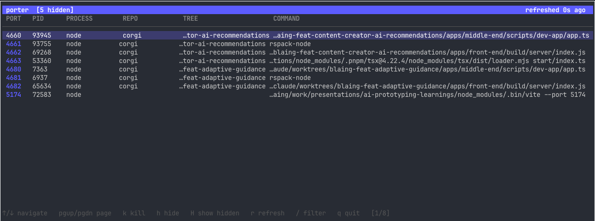

# porter

A terminal UI for monitoring listening ports on macOS. Shows each process's port, PID, name, and the git repo/worktree it's running from. Kill processes, filter by port or repo, and permanently hide noisy system apps like Chrome or Postman.



## Keybindings

| Key | Action |
|-----|--------|
| `↑` / `↓` | Navigate |
| `enter` | Open selected port in browser (`http://localhost:<port>`) |
| `pgup` / `pgdn` | Page up / down |
| `k` | Kill selected process (prompts for confirmation) |
| `h` | Hide selected process by name (persisted across restarts) |
| `H` | Toggle showing hidden processes |
| `u` | Unhide selected process (while hidden processes are visible) |
| `/` | Filter by port number or repo name |
| `esc` | Clear filter |
| `r` | Force refresh |
| `q` / `ctrl+c` | Quit |

Hidden process names are saved to `~/.porter/hidden.json`.

## Install

**Via Makefile (installs to `/usr/local/bin`):**

```sh
make install
```

**Via `go install`:**

```sh
go install github.com/blaingb/porter@latest
```

## Run without installing

```sh
make build
./porter
```

Or directly:

```sh
go run .
```

## Requirements

- macOS (uses `lsof` and `ps`)
- Go 1.21+ — install with `brew install go`
